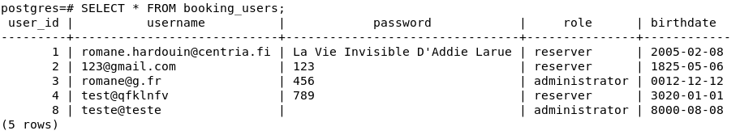
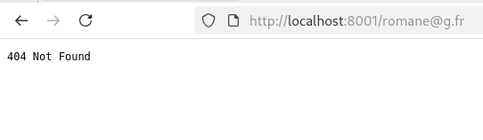
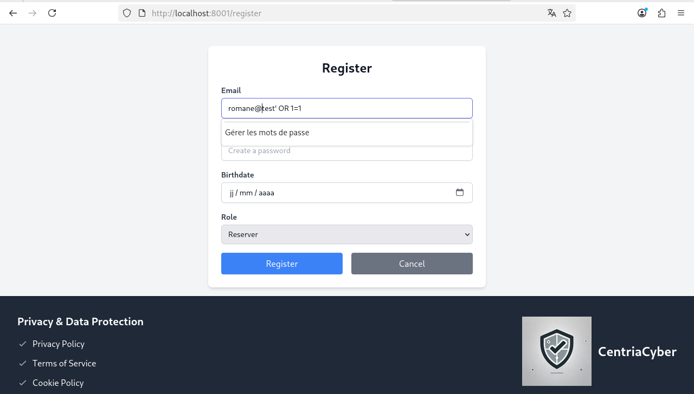
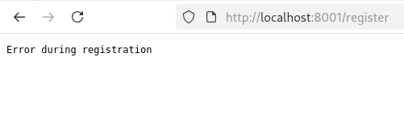

# Pentesting Report - Phase 1

## 1. General Information

**Tester(s):**
* Romane Hardouin and Athénaïs Bruniaux

**Purpose:**
Identify vulnerabilities in registration and authentication flows

**Scope:**
* **Tested components:** User Registration Form (Frontend), PostgreSQL Database storage (Backend).
* **Exclusions:** Login functionality, User sessions, Resource booking system, GDPR compliance (not testable yet).

**Test approach:**
Gray-box

**Test environment & dates:**
* **Start:** 30/01/2026
* **End:** 04/02/2026
* **Test environment details:**
    - OS: Debian Linux (VM)
    - Runtime: Docker version 29.2.0
    - DB: PostgreSQL
    - Browsers: Mozilla Firefox 140.4.0esr

**Assumptions & constraints:**
* **Constraints:** Limited time for Phase 1 (04/02/2026). The login button is non-functional (returns 404 error). Access is limited to the local Docker environment only.
* **Assumptions:** The developer claims the system follows "Privacy by Design", so I assumed sensitive data should be encrypted from the start.

---

## 2. Executive Summary

**Short summary:**
The website's registration is currently not secure because passwords are saved in plain text and anyone can choose to be an Admin. Also, the form accepts impossible birth dates, and the login button doesn't work, so the system needs major fixes before it can be used.

**Overall risk level:** 🔴 **High**

**Top 5 immediate actions:**
1. **Implement Strong Password Hashing:** Immediately stop storing passwords in plain text (F-01).
2. **Restrict Administrative Role Assignment:** Remove the role selection dropdown from the public registration form (F-03).
3. **Enforce Strict Server-Side Validation:** Fix the disconnect between the frontend and the database (F-07).
4. **Fix Core Authentication Functionality:** Resolve the technical bugs preventing the Login button from working (F-05).
5. **Enhance Data Input Sanitization:** Improve handling of international characters (F-09) and email domain verification (F-08).

---

## 3. Findings

| ID | Severity | Finding | Description | Evidence / Proof |
|:---|:---|:---|:---|:---|
| **F-01** | 🔴 High | Plain-text password storage | The database stores passwords without any hashing or encryption. | `SELECT * FROM booking_users;` shows readable passwords.  |
| **F-02** | 🟠 Medium | Lack of age validation | The system ignores the "15+ years old" rule and accepts unrealistic birth years. | Registration successful with birth year 1825.  |
| **F-03** | 🔴 High | Insecure Privilege Assignment | New users can choose their own permission level (Admin) during registration. | Dropdown menu allows "Admin" selection.  |
| **F-04** | 🔵 Info | Basic Email Syntax Check | The system requires an "@" symbol to proceed. | Error occurs when registering without "@". |
| **F-05** | 🟡 Low | Broken Login & Navigation | The Login button and internal pages are non-functional. | Button does nothing; pages return 404 Not Found.  |
| **F-06** | 🔴 High | Empty Password Acceptance | The system accepts passwords consisting only of blank spaces (" "). | Account created with " " as password.  |
| **F-07** | 🟠 Medium | Silent Frontend Errors | JavaScript error logic exists in the code but is never displayed. | No feedback given for invalid data.  |
| **F-08** | 🟡 Low | Lack of Domain Validation | The system accepts fake email domains (ex: @abcde). | Registration successful with non-existent providers.  |
| **F-09** | 🟡 Low | Non-Latin Character Failure | System fails to process non-Latin characters (ex: Chinese). | Registration fails silently. |
| **F-10** | 🔵 Info | Input Length Restriction | The system correctly blocks excessively long strings. | Long text of "A"s was rejected. |
| **F-11** | 🔵 Info | Duplicate Email Protection | Prevents multiple accounts with the same email. | Error "Error during the registration" triggered.  |
